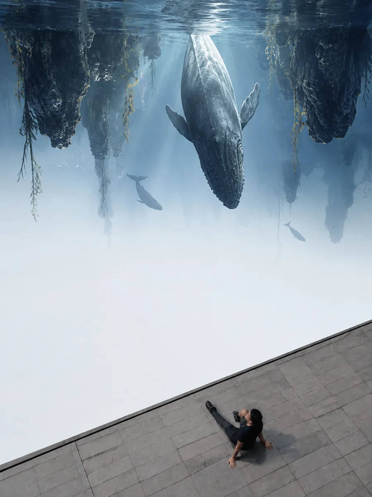
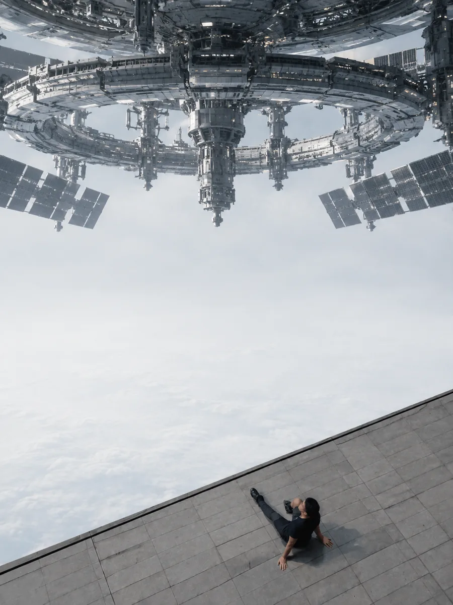
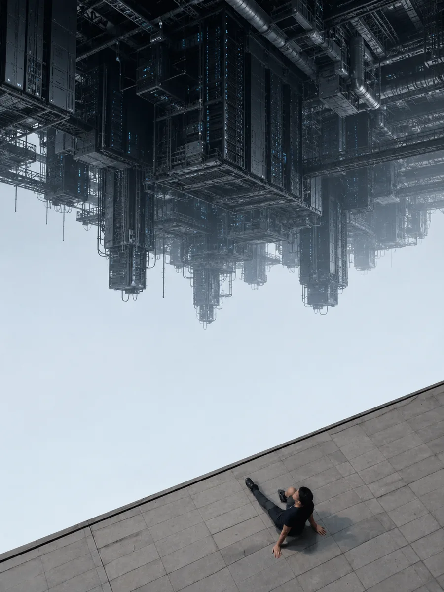
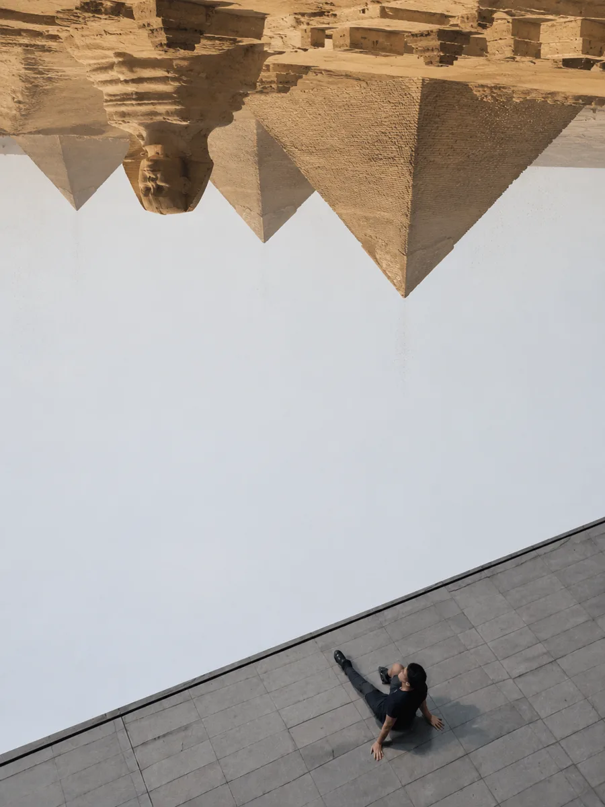
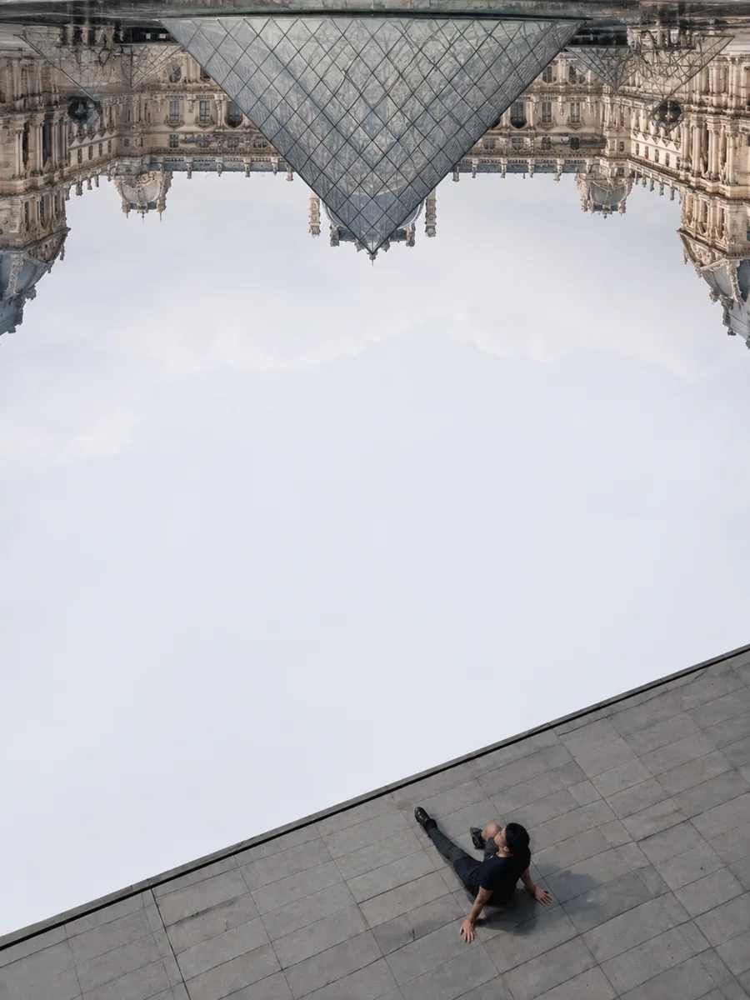
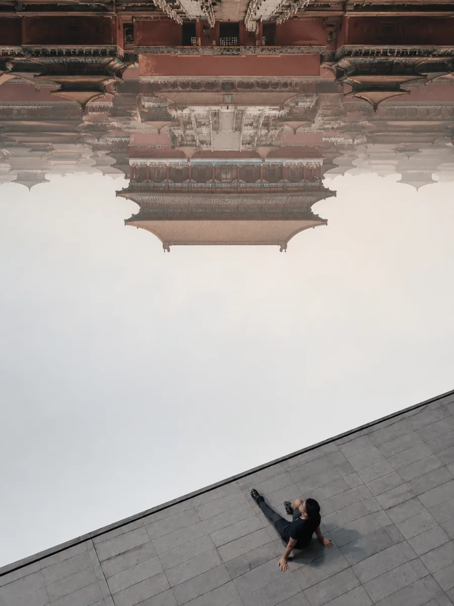

# 低配版盗梦空间 / Budget Inception Poster

[中文](README.md) · [English](README_EN.md)

把普通人物照片变成一张不存在的旅游打卡照：人物和脚下的现实保持不变，头顶倒悬一个宏大的虚拟世界。

> 坐在现实的边缘，打卡一个并不存在的世界。

<p align="center">
  
  
  
</p>

## 项目起源

这个项目的灵感，来自我每天下班经过国贸时看到的打卡人群。大家排队等待同一个机位、同一片风景，于是我萌生了一个想法：如果拍照不再需要排队，眼前的风景也不必固定，会发生什么？一个普通人坐在现实的边缘，头顶却可以倒悬任何宏大的远方——这就是这个项目的起源。

## 核心结构

- **下方现实层固定**：保留人物、姿势、衣服、平台、斜边、视角与阴影。
- **上方幻想层变化**：生成倒置的鲸鱼海洋、空间站、金字塔、卢浮宫、数据中心等宏大世界。
- **中间保留空场**：让普通现实与虚拟奇观相互分离。
- **不加文字和装饰**：讽刺感来自真实人物与虚假风景的反差，而不是海报特效。

## 两种模式

### 指定入梦

上传人物照片并指定上方主题：

```text
使用 @budget-inception-poster，把上方变成倒置的巨型空间站。
```

### 随机入梦

只上传照片，不指定主题：

```text
使用 @budget-inception-poster，随机入梦。
```

Skill 会从几何地标、科技结构、自然巨物、文化空间和城市世界中选择反差最强的主题。

## 更多测试

<p align="center">
  
  
  
</p>

## 适合的照片

- 竖版画面
- 人物坐在平台、屋顶、台阶或其他硬质边缘
- 人物位于画面下方
- 上方有大面积天空或干净留白
- 普通、日常的衣服和姿态更有效

## 视觉公式

```text
普通人物 + 真实平台 + 中间空场 + 顶部倒置宏大世界
= 一张刻意制造的虚假旅游打卡照
```

## 安装

将本仓库中的 `SKILL.md` 与 `references/` 目录作为一个 Skill 文件夹安装。触发名称：

```text
@budget-inception-poster
```

## License

MIT
